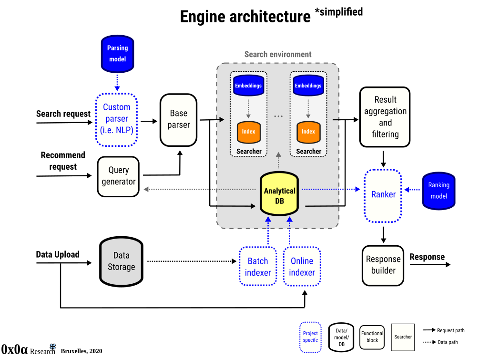

```@meta
CurrentModule=Garamond
```

!!! warning "Work in progress!"

    The engine is currently under heavy development and the documentation may be slightly out of date. As the API stabilizes, both the content and scope of the present documentation will increase. For any inquiries, bugs or feature requests, be sure to contact the developers or [file an issue](https://github.com/zgornel/Garamond.jl/issues/new).

# Introduction

Garamond is a small, flexible neural and data search engine. It can be used both as a Julia package, with search functionality available through API method calls or as a standalone search server, with search functionality accessible through clients that communicate with the server.

Internally, the engine's architecture is that of an ensemble of searchers, with an analytical database as data backend. Each searcher has its own characteristics i.e. ways of embedding documents, searching through the vectors and the search results from all searchers can be combined in a variety of ways. The engine supports runtime loading and use of custom data loaders, recommendation engines and result rankers.


## Installation

The `Garamond` repository can be downloaded through git:
```
$ git clone https://github.com/zgornel/Garamond.jl
```
or from inside Julia. Entering the Pkg mode with `]` and writing:
```
add https://github.com/zgornel/Garamond.jl#master
```
downloads the `master` branch of the repository and adds `Garamond` to the current active environment.


## Architecture


Architecturally, the engine employs an analytical database and a series of searcher objects to perform the search. The database acts as data source to create the searchers as well as for building responses for clients and as input source for the ranking and recommendation operations. Incoming search, recommendation or ranking requests are parsed to an internal request format and sent to the database, searchers or all, depending on the request. The results are then filtered and aggregated and a response is built and sent to the client. Any number of searcher objects can be created and each of these can re-use data embedders i.e. objects that transform data into numerical vectors. Data can be either indexed while the engine is running online i.e. pushed into all indexes plus database or, by fully reloading and reindexing. The engine supports runtime compilation of  custom data loaders, parsers, rankers and recommenders. These can be thin clients that connect i.e. through TCP sockets, HTTP, to external systems that perform the actual workload, provided that the internal client APIs are implemented.


## Main features

- In-memory analytical db based on [JuliaDB](https://juliadb.org)
- Pluggable support for custom parsers, loaders, recommenders and rankers
- Millon-scale indexing using [hnsw](https://arxiv.org/abs/1603.09320)
- Billion-scale search through [IVFADC](https://github.com/JuliaNeighbors/IVFADC.jl)
- Online indexing i.e. fast push/pop to/from index and db
- Runtime batch re-indexing i.e. reindex while operating
- HTTP(REST), Web-socket and UNIX socket connectivity
- Complex query search patterns supported
- Data embedders are a shared resource - each searcher can have different input and data embedders
- Wordvectors support: [Word2Vec](https://en.wikipedia.org/wiki/Word2vec), [ConceptnetNumberbatch](https://github.com/commonsense/conceptnet-numberbatch), [GloVe](https://nlp.stanford.edu/projects/glove/)
- Compressed vector support for low-memory footprint using [array quantization](https://github.com/zgornel/QuantizedArrays.jl)
- Classic search based on [term frequency](https://en.wikipedia.org/wiki/Tf%E2%80%93idf#Term_frequency_2), [tf-idf](https://en.wikipedia.org/wiki/Tf%E2%80%93idf#Term_frequency%E2%80%93Inverse_document_frequency), [bm25](https://en.wikipedia.org/wiki/Okapi_BM25)
- Suggestion support using [BK Trees](https://en.wikipedia.org/wiki/BK-tree)
- Many state-of-the-art neural document and sentence embedding methods
- Multi-threading [supported](https://github.com/zgornel/Garamond.jl/tree/cc-multithreading)
- Caching mechanisms for fast resume
- Portable and statically compilable to many architectures


## Longer term plans
- Extend search to Images, Videos and Audio i.e. generic search
- Peer-to-peer / distributed operations support
